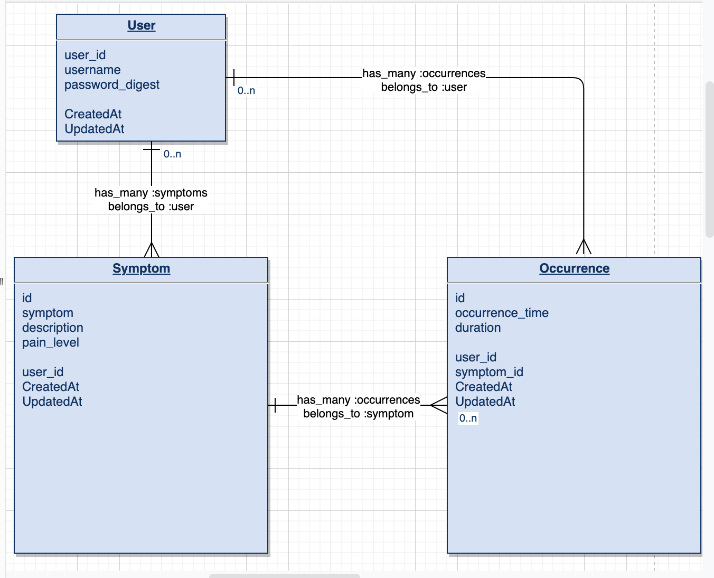

# Symptomatic README <!-- omit in toc -->

- [Overview](#overview)
- [MVP](#mvp)
  - [Libraries and Dependencies](#libraries-and-dependencies)
  - [Client (Front End)](#client-front-end)
    - [Wireframes](#wireframes)
    - [Component Tree](#component-tree)
    - [Component Hierarchy](#component-hierarchy)
    - [Component Breakdown](#component-breakdown)
    - [Time Estimates](#time-estimates)
  - [Server (Back End)](#server-back-end)
    - [ERD Model](#erd-model)
- [Post-MVP](#post-mvp)
- [Code Showcase](#code-showcase)
- [Code Issues & Resolutions](#code-issues--resolutions)

<br>

## Overview

**Symptomatic** is a symptoms tracker app helping you to mark your symptoms, wthen they occurred and the pain level, all in one place. Symptomatic will provide a marked calendar with how often you felt the symptom and a cummulative count of each symptom to show you what you should be talking to your doctor about. 

<br>

### MVP Goals

- _Create a full-stack application that utilizes user authentication_
- _Allow the user to create a new symptom_
- _Be able to put a note with the symptom and edit it_
- _See each symptom as a color on a calendar_


<br>

### Libraries and Dependencies

|     Library      | Description                                |
| :--------------: | :----------------------------------------- |
|      React       | _Symptomatic main front-end library._ |
|     Ruby on Rails      | _To create the backend database._ |
|   React Router   | _For front-end routing._ |
| Axios | _To make HTTP requests._ |


<br>


#### Wireframes


[Symptomatic Wireframe](https://whimsical.com/FFd9ZV7DhQ84C962p2smtu)


#### Component Hierarchy 

``` structure

src
|__ components/
      |__ Graph.jsx. -- reuseable
      |__ Calendar.jsx 
      |__ SymptomCard.jsx
      |__ Pain.jsx 
      |__ OccurrenceCard.jsx 
      |__ NewSymptomForm.jsx 
|__ containers/
      |__ MainContainer.jsx
|__ shared/
      |__ Layout.jsx
      |__ Header.jsx
      |__ Footer.jsx
|__ screens/
      |__ Register.jsx
      |__ Login.jsx
      |__ Home.jsx 
      |__ MySymptoms.jsx
      |__ MyCalendar.jsx
      |__ AddSymptom.jsx
      |__ SymptomDetail.jsx
      |__ OccurrenceDetail.jsx
      

```

#### Component Breakdown
 

|  Component   |    Type    | state | props | Description                                                      |
| :----------: | :--------: | :---: | :---: | :--------------------------------------------------------------- |
|  Calendar  | functional |   y   |   y   | _The calendar will provide a month layout of what days each symptom occurred ._       |
|   SymptomCard    |   functional    |   n   |   y   | _Users will be able to see the description, time and duration for every symptom occurence  _      |
| Pain | functional |   y   |   n   | _ Have the user be able to click on what pain level they're at._                 |
|    OccurrenceCard    | functional |   n   |   y   | _A summary of what the occurrence is._ |
|    NewSymptomForm    | functional |   y   |   y   | _Give the user the ability to create a new symptom occurrence._ |
|    Graph    | functional |   y   |   y   | _The graph will be reuseable component to determine what percent of symptoms rank highest._               |


#### Component Tree


#### Time Estimates


| Task                | Priority | Estimated Time | Time Invested | Actual Time |
| ------------------- | :------: | :------------: | :-----------: | :---------: |
| Create backend models    |    H     |     1 hr      |   1   hr     |   -     |
| Create controllers    |    H     |     2 hrs      |   2hrs     |   -     |
| Set up routes    |    H     |     1 hr      |   1   hr     |   -     |
| Set up user auth    |    H     |     2 hr      |   2   hrs     |   -     |
| Create app architecture    |    H     |     1 hr      |   1   hr     |   -     |
| Create Login/Register ability    |    H     |     2 hr      |   2   hrs     |   -     |
| Layout component and rendering on home    |    H     |     1 hr      |   1   hr     |   -     |
| Create MySymptoms screen    |    H     |     2 hr      |   2  hrs     |   -     |
| Create MyCalendar screen    |    H     |     2 hr      |   2  hrs     |   -     |
| Create Calendar    |    H     |     3 hrs      |   3  hrs     |   -     |
| Create SymptomDetail screen    |    H     |     2 hr      |   2  hrs     |   -     |
| Create SymptomCard    |    H     |     1 hr      |   1  hr     |   -     |
| Create AddSymptom screen    |    H     |     2 hr      |   2  hrs     |   -     |
| Make NewSymptomForm functional    |    H     |     2 hr      |   2  hrs     |   -     |
| Create Pain component    |    H     |     1 hr      |   1  hr     |   -     |
| Create OccurrenceDetail screen    |    L     |     2 hr      |   2  hrs     |   -     |
| Create OccurrenceCard    |    L     |     1 hr      |   1  hr     |   -     |
| Create MySymptoms screen    |    L     |     2 hr      |   2  hrs     |   -     |
| Create Graph    |    L     |     1 hr      |   1  hr     |   -     |

| TOTAL               |          |     - hrs      |    -hrs     |     -hrs   |

<br>

### Server (Back End)

#### ERD Model


>
<br>

***

## Post-MVP

- _Have a total count of each symptom on a graph_
- _Be able to select level of pain a pain chart_
- _Have the faces on the pain chart animated_

***

## Code Showcase
- _Yet to come! 

``` structure


```
## Code Issues & Resolutions

- _Yet to come! 
